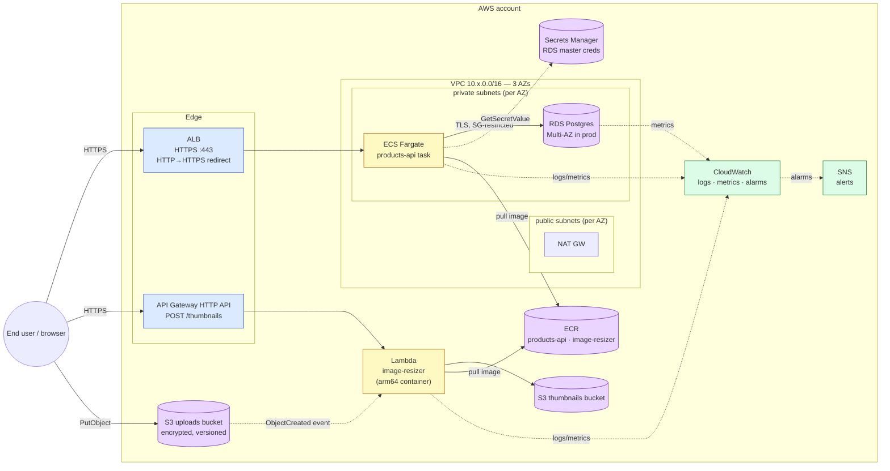

# aws-microservices-terraform

[](.github/workflows/terraform-pr.yml)
[](.terraform-version)
[](modules)
[](LICENSE)

Production-grade AWS microservices reference architecture, written as
**reusable Terraform modules** composed into per-environment stacks. The
example use case is a small product-catalog API:

- **`products-api`** — REST service on **ECS Fargate** behind an **ALB**,
  reading from **RDS Postgres**, with credentials in **Secrets Manager**.
- **`image-resizer`** — **Lambda** (container image, arm64) triggered by
  **S3** uploads, also fronted by **API Gateway** HTTP API for manual
  invocation.

The repo is meant to demonstrate IaC fluency end-to-end: networking,
identity, storage, compute, edge, observability, CI/CD, and the boring
tooling around them — **not** a "hello world in Terraform".

---

## Architecture



The same modules build all three environments (`dev`, `staging`, `prod`).
What differs between them is **inputs only** — no module forks, no copy-paste.

---

## Repository layout

```
.
├── bootstrap/                Run-once: S3 state bucket + DynamoDB lock + KMS
├── modules/
│   ├── vpc/                  VPC, public/private subnets, NAT, VPC endpoints
│   ├── rds-postgres/         RDS, SG, Secrets Manager, alarms
│   ├── ecr-repo/             ECR with lifecycle policy, immutable tags
│   ├── alb/                  ALB, HTTPS listener, HTTP→HTTPS redirect
│   ├── ecs-service/          Fargate cluster, task def, service, IAM, target group
│   ├── lambda-fn/            Lambda (zip or image), IAM, alarms, S3 sources
│   └── api-gateway/          HTTP API, integrations, JWT auth, CORS
├── environments/
│   ├── dev/                  Cheap composition (single NAT, single-AZ RDS)
│   ├── staging/              Prod-like resilience, smaller scale
│   └── prod/                 Multi-AZ everywhere, hard validations
├── .github/workflows/
│   ├── terraform-pr.yml      fmt + validate + tflint + checkov + plan comment
│   └── terraform-apply.yml   Manual dispatch, gated by GitHub Environments
└── docs/
    └── decisions.md          Architecture decision log
```

---

## Why this architecture

A condensed decision log. The full version with alternatives and trade-offs
is in [`docs/decisions.md`](docs/decisions.md).

| Choice | Reason |
|---|---|
| **ECS Fargate, not EKS** | The use case has two services. Kubernetes is operational overhead with no payoff at this scale. Fargate gives you task-level networking and IAM with zero node management. |
| **Lambda for image resizing, not ECS** | Bursty, embarrassingly parallel, S3-event driven. Sub-15-min runtime. Lambda's pricing model fits this workload exactly. |
| **RDS Postgres, not DynamoDB** | The catalog has relational queries (joins, range scans by category). DynamoDB optimises for known-key access patterns; this isn't one. |
| **ALB for ECS, API Gateway for Lambda** | ALB handles long-lived connections, host/path-based routing for many services on one LB, and is cheaper at high RPS. API Gateway HTTP API is the right fit for serverless: pay per request, JWT built-in, throttling and CORS without writing handler code. |
| **Per-AZ NAT in prod, single NAT in dev** | One NAT per AZ ≈ +$32/month each. In dev one NAT is fine; in prod the cost is tiny vs the cost of an AZ-wide outage taking down all egress. |
| **Two IAM roles per ECS service** (execution vs task) | Execution role pulls images, writes logs, fetches declared secrets. Task role is what app code can do. Mixing them is a common mistake; splitting is essential to least-privilege. |
| **Secrets in Secrets Manager, not env vars / tfvars** | tfvars get committed by accident. Secrets Manager is auditable via CloudTrail and rotatable. |
| **S3 buckets always encrypted, versioned, public-blocked, ownership=BucketOwnerEnforced** | The four mistakes that cause real-world breaches. Default-on. |
| **Custom log retention + KMS, not implicit log groups** | If Lambda or ECS create their log groups implicitly, retention defaults to **infinite** — surprise CloudWatch bill. |
| **Module deliberately *does not* own things outside its scope** | The ECS service module does not create the ALB; the API Gateway module does not create the Lambda. Composition stays in the env layer where it belongs. |
| **Remote state in S3 + DynamoDB lock + KMS, bootstrapped separately** | Single-source-of-truth state, multi-engineer locking, encryption at rest, recoverable via versioning. The chicken-and-egg of "where does the state of the state bucket live" is solved by `bootstrap/` running with local state. |
| **OIDC to AWS from GitHub Actions** | No long-lived access keys in CI secrets. Trust policy can scope by repo + branch + environment. |

---

## Quickstart

Three steps; see each environment's README for the per-env detail.

```bash
# 1. Bootstrap the remote state backend (run-once per AWS account)
cd bootstrap
cp example.tfvars terraform.tfvars   # set your unique bucket name
terraform init && terraform apply

# 2. Wire each environment to the bucket created above
#    Edit environments/<env>/backend.tf — replace CHANGE-ME placeholders.

# 3. Plan & apply dev
cd ../environments/dev
cp terraform.tfvars.example terraform.tfvars
terraform init
terraform plan -out=plan.tfplan
terraform apply plan.tfplan
```

After the first apply, push a placeholder image to each ECR repo so ECS can
start tasks (see `environments/dev/README.md` for the exact `docker push`
commands).

---

## Cost estimate

Rough monthly running cost in **us-east-1**, assuming reasonable but
non-spiky load. Real numbers depend on traffic.

### `dev` — ≈ **$70–90 / month**

| Resource | Notes | Cost |
|---|---|---|
| 1 × NAT Gateway | single-NAT, ~5 GB/month egress | ~$35 |
| 1 × RDS `db.t4g.micro` (single-AZ, 20 GB gp3) | free tier eligible for 12 months | $0–17 |
| 1 × ECS Fargate task (0.5 vCPU / 1 GiB) | running 24/7 | ~$15 |
| 1 × ALB (low traffic) | 1 LCU baseline | ~$17 |
| Lambda (image-resizer) | invoked sparsely | ~$0 |
| API Gateway HTTP API | <1M requests | ~$0 |
| ECR storage (2 repos × ~500 MB) | | ~$0.10 |
| CloudWatch logs (14d retention) | | ~$1–5 |
| S3 (uploads + thumbnails + ALB logs) | tens of MB | ~$0.10 |
| Secrets Manager (1 secret) | $0.40/secret + API calls | ~$0.50 |
| **Total** | | **≈ $70–90** |

### `prod` — ≈ **$650–900 / month** (without app traffic)

| Resource | Notes | Cost |
|---|---|---|
| 3 × NAT Gateway | per-AZ, redundant | ~$100 + egress |
| 1 × RDS `db.m7g.large` (Multi-AZ, 100 GB gp3, 30d backups) | | ~$300 |
| 4 × ECS Fargate task (1 vCPU / 2 GiB) | 24/7 | ~$120 |
| 1 × ALB | medium LCU | ~$20–60 |
| Lambda + DLQ | | depends on volume |
| API Gateway | depends on volume | depends |
| 4 × VPC interface endpoints (ECR/Logs/SecretsManager × 3 AZs) | | ~$80 |
| VPC flow logs (90d) | | ~$5–20 |
| CloudWatch logs (90d) | | ~$10–40 |
| S3 + lifecycle | | varies |
| **Total (idle)** | | **≈ $650–900** |

Bigger drivers under load: NAT egress data, ALB LCUs, Lambda invocations,
RDS storage growth.

> **Free-tier note**: For the first 12 months a new AWS account covers a
> chunk of the dev costs (RDS micro hours, S3 GB, Lambda invocations).
> After that, dev is roughly the figure above.

---

## Tear down

```bash
# Empty buckets first — Terraform refuses to destroy non-empty S3 buckets
# (and that's deliberate; force_destroy is off everywhere).
for bucket in $(terraform output -json | jq -r '..|objects|.value? // empty | select(test("^[a-z0-9.-]{3,63}$"))'); do
  aws s3 rm "s3://$bucket" --recursive 2>/dev/null || true
done

terraform destroy
```

The `bootstrap/` stack is intentionally not destroyed by the env teardown —
its bucket holds state for *every* environment. Destroy it manually only
after every env has been destroyed and you've moved or backed up state.

---

## CI/CD

Two GitHub Actions workflows ([`/.github/workflows/`](.github/workflows/README.md)):

- **PR workflow** runs on every pull request: `terraform fmt -check`,
  `terraform validate` against every stack, `tflint` (recursive, with the
  AWS plugin), `checkov`, and — when configured — `terraform plan` against
  `dev` posted as a sticky comment.
- **Apply workflow** is **manual dispatch only**. Choose the env, GitHub
  Environments enforces required-reviewer approval before apply runs. No
  auto-apply on merge to `main`.

Both workflows authenticate to AWS via **OIDC** — no long-lived access keys.

---

## What I'd add for real prod

These are deliberate omissions to keep the demo focused. Each is a
straightforward bolt-on.

- **WAF** in front of the ALB and API Gateway (managed rule sets +
  custom rate-based).
- **Custom domains** via ACM + Route 53 alias records, both for the ALB
  (`api.example.com`) and API Gateway (`api-admin.example.com`). The
  `api-gateway` module is one resource (`aws_apigatewayv2_domain_name`)
  away from supporting it.
- **Blue/green deploys** for ECS via CodeDeploy (`DeploymentController = CODE_DEPLOY`),
  with two target groups and listener-shifting hooks.
- **Application autoscaling** on the ECS service (target tracking on
  CPU / ALBRequestCountPerTarget) and Lambda provisioned concurrency for
  cold-start-sensitive endpoints.
- **Secrets rotation** for the RDS master credential (Secrets Manager
  rotation Lambda).
- **Multi-region** with read replicas, Route 53 health checks, and an
  S3 cross-region replication rule for the uploads bucket.
- **Authentication** in front of `products-api` — Cognito user pool wired
  into the API Gateway JWT authorizer (the `api-gateway` module already
  supports this).
- **Compliance evidence**: AWS Config rules, GuardDuty, CloudTrail to a
  centralised log archive account.
- **Backup vault** with cross-account / cross-region copies for RDS and EBS.
- **Cost monitoring**: cost allocation tags (already set), Cost Anomaly
  Detection alerts to the alerts SNS topic.
- **terratest** suite that does a `plan` against an isolated AWS account
  per PR. Listed in the testing tradeoffs section of `docs/decisions.md`.
- **OPA / Conftest** policies to enforce repo conventions (every S3 bucket
  has SSE, every IAM policy has resource scoping, etc.) on top of `checkov`.

---

## License

[MIT](LICENSE).
